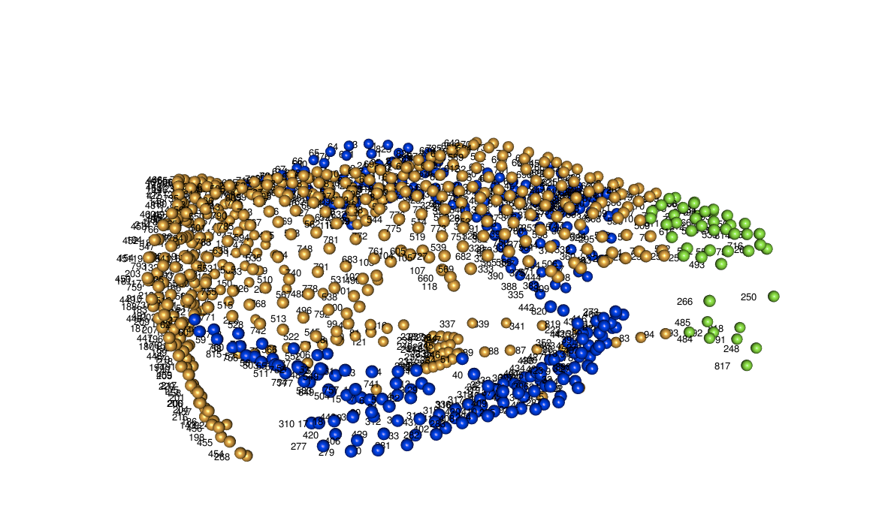
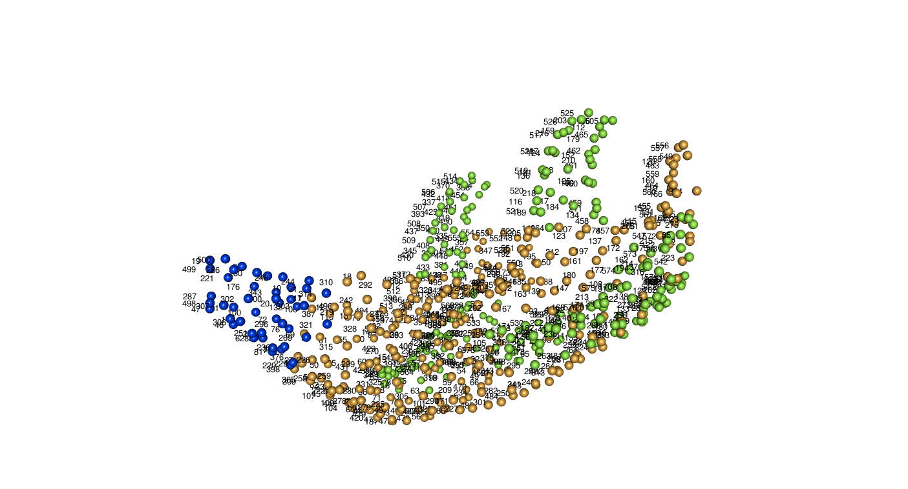

```{r}
## Loading the libraries (and installing if necessary)
if(!require(geomorph)) install.packages("geomorph")
```

This script reads in the data and saves it in the proper format to be analysed

## Inputs

The data should be stored in `../Data/` in the following format:

Data type | Data set | Species | File format
----------|----------|---------|------------
classifier|  cranium|wombat|.csv
landmarkdata | cranium  | wombat | .csv
landmarkgroups | mandible | wombat |.csv


## Partitions

### Cranium




Partition name | Colour | ID in landmarkgroups | default order in test | Name in publication
---|---|---|---|---
zygomatic | blue | 1 | 1 | Zygomatic arch
rest | orange | 2 | 2 | Remainders
snout | green | 3 | 3 | Tip of snout


### Mandible




Partition name | Colour | ID in landmarkgroups | default order in test | Name in publication
---|---|---|---|---
back | green | 1 | 3 | Masticatory insertions
front | blue | 2 | 1 | Symphyseal area
rest | orange | 3 | 2 | Remainders


### Data per genus

Includes gpa coordinates (procrustes), landmark partitions (landmarkgroups), and principal component output (ordination)

```{r}
## The chain names; in case there are several species, but it is only one species here
chains <- c("wombat")

## The datasets
datasets <- c("cranium", "mandible")

## Looping through the chains
for(chain in chains) {
    
    ## Output list holder
    land_data <- list()

    ## Looping through the datasets
    for(dataset in datasets) {

        ## Read the landmarks groups
        land_data[[dataset]][[1]] <- read.csv(paste0("../Data/Raw/landmarkgroups_", dataset, "_",
                                                chain, ".csv"))

        ## Translating the landmark groups names
        if(dataset == "cranium") {
            land_data[[dataset]][[1]][,2] <- gsub(1, "zygomatic", land_data[[dataset]][[1]][,2])
            land_data[[dataset]][[1]][,2] <- gsub(2, "rest", land_data[[dataset]][[1]][,2])
            land_data[[dataset]][[1]][,2] <- gsub(3, "snout", land_data[[dataset]][[1]][,2])
        }

        if(dataset == "mandible") {
            land_data[[dataset]][[1]][,2] <- gsub(1, "back", land_data[[dataset]][[1]][,2])
            land_data[[dataset]][[1]][,2] <- gsub(2, "front", land_data[[dataset]][[1]][,2])
            land_data[[dataset]][[1]][,2] <- gsub(3, "rest", land_data[[dataset]][[1]][,2])
        }

        ## Read the landmarks
        landmarks  <- t(read.csv(paste0("../Data/Raw/landmarkdata_", dataset, "_", chain, ".csv"),
                                 header = TRUE, row.names = 1))

        ## Remove the juvenile NHNW_B34's mandible
        if(dataset == "mandible") {
            nhnw_b34 <- which(rownames(landmarks) == "NHNW_B34")
            landmarks <- landmarks[-nhnw_b34,]
        }
        
        ## Remove the patches
        landmarks_no_patches <- landmarks[, -c(grep("patch", colnames(landmarks)))]

        ## Remove the patches and curves
        landmarks_no_patches_no_curves <- landmarks_no_patches[, -c(grep(" CUR ",
                                                                 colnames(landmarks_no_patches)))]

        ## Make into a 3D array
        landmarks <- geomorph::arrayspecs(landmarks, k = 3, p = ncol(landmarks)/3)
        landmarks_no_patches <- geomorph::arrayspecs(landmarks_no_patches, k = 3,
                                                     p = ncol(landmarks_no_patches)/3)
        landmarks_no_patches_no_curves <- geomorph::arrayspecs(landmarks_no_patches_no_curves,
                                                     k = 3,
                                                     p = ncol(landmarks_no_patches_no_curves)/3)
        
        ## Running the Procrustes superimposition
        land_data[[dataset]][[2]] <- geomorph::gpagen(landmarks)
        land_data[[dataset]][[4]] <- geomorph::gpagen(landmarks_no_patches)
        land_data[[dataset]][[5]] <- geomorph::gpagen(landmarks_no_patches_no_curves)

        ## Convert the array in 2D
        array_2d <- geomorph::two.d.array(land_data[[dataset]][[2]]$coords)

        ## measure the tolerance; the below is part of the geomorph "PlotTangentSpace" code
        tol <- prcomp(array_2d)$sdev^2
        tolerance <- cumsum(tol)/sum(tol)
        tolerance <- length(which(tolerance < 1)) 
        if(length(tolerance) < length(tol)){
            tolerance <- tolerance + 1
        }
        tolerance <- max(c(tol[tolerance]/tol[1],0.005))

        ## Ordinating the data
        land_data[[dataset]][[3]] <- prcomp(array_2d, center = TRUE, scale. = FALSE, retx = TRUE,
                                              tol = tolerance)

        ## Name the elements
        names(land_data[[dataset]]) <- c("landmarkgroups",
                                         "procrustes", "ordination",
                                         "procrustes_no_patches",
                                         "procrustes_no_patches_no_curves")
    }

    ## Check if Processed folder exists
    if(!dir.exists("../Data/Processed")) {
        dir.create("../Data/Processed")
    }

    ## Save the file
    save(land_data, file = paste0("../Data/Processed/", chain, ".Rda"))
}
```

### Data per species

```{r}
## Selecting the wombats
chain <- chains[1]

## Getting the species names
species <- c("ursinus", "latifrons", "krefftii", "lasiorhinus")
sp_holders <- c("Common wombat", "SHN wombat", "NHN wombat")

for(sp in 1:length(species)) {

    land_data <- list()

    for(dataset in datasets) {

        ## Reading the wombat species
        wombat_sp <- read.csv(paste0("../Data/Raw/classifier_", dataset, "_wombat.csv"))
        for(spec in 1:length(species[1:3])) {
            wombat_sp$Species <- gsub(sp_holders[spec], species[spec],
                                      as.character(wombat_sp$Species))
        }

        ## Read the landmarks groups
        land_data[[dataset]][[1]] <- read.csv(paste0("../Data/Raw/landmarkgroups_", dataset, "_",
                                                chain, ".csv"))

        ## Translating the landmark groups names
        if(dataset == "cranium") {
            land_data[[dataset]][[1]][,2] <- gsub(1, "zygomatic", land_data[[dataset]][[1]][,2])
            land_data[[dataset]][[1]][,2] <- gsub(2, "rest", land_data[[dataset]][[1]][,2])
            land_data[[dataset]][[1]][,2] <- gsub(3, "snout", land_data[[dataset]][[1]][,2])
        }

        if(dataset == "mandible") {
            land_data[[dataset]][[1]][,2] <- gsub(1, "back", land_data[[dataset]][[1]][,2])
            land_data[[dataset]][[1]][,2] <- gsub(2, "front", land_data[[dataset]][[1]][,2])
            land_data[[dataset]][[1]][,2] <- gsub(3, "rest", land_data[[dataset]][[1]][,2])
        }

        ## Read the landmarks
        landmarks <- t(read.csv(paste0("../Data/Raw/landmarkdata_", dataset, "_", chain, ".csv"),
                                 header = TRUE, row.names = 1))

        ## Remove the juvenile NHNW_B34's mandible
        if(dataset == "mandible") {
            nhnw_b34 <- which(rownames(landmarks) == "NHNW_B34")
            landmarks <- landmarks[-nhnw_b34,]
            wombat_sp <- wombat_sp[-nhnw_b34,]
        }

        ## Remove the patches
        landmarks_no_patches <- landmarks[, -c(grep("patch", colnames(landmarks)))]

        ## Remove the patches and curves
        landmarks_no_patches_no_curves <- landmarks_no_patches[, -c(grep(" CUR ",
                                                                 colnames(landmarks_no_patches)))]

        ## Make into a 3D array
        landmarks <- geomorph::arrayspecs(landmarks, k = 3, p = ncol(landmarks)/3)
        landmarks_no_patches <- geomorph::arrayspecs(landmarks_no_patches, k = 3,
                                                     p = ncol(landmarks_no_patches)/3)
        landmarks_no_patches_no_curves <- geomorph::arrayspecs(landmarks_no_patches_no_curves,
                                                     k = 3,
                                                     p = ncol(landmarks_no_patches_no_curves)/3)

        ## Selecting the subset of species (if sp == 4, select both krefftii and latifrons)
        if(sp != 4) {
            which_sp <- sp
        } else {
            which_sp <- c(2,3)
        }
        landmarks <- landmarks[, , which(wombat_sp$Species %in% species[which_sp])]
        landmarks_no_patches <- landmarks_no_patches[, ,
                                                    which(wombat_sp$Species %in% species[which_sp])]
        landmarks_no_patches_no_curves <- landmarks_no_patches_no_curves[, ,
                                                    which(wombat_sp$Species %in% species[which_sp])]

        ## Running the Procrustes superimposition
        land_data[[dataset]][[2]] <- geomorph::gpagen(landmarks)
        land_data[[dataset]][[4]] <- geomorph::gpagen(landmarks_no_patches)
        land_data[[dataset]][[5]] <- geomorph::gpagen(landmarks_no_patches_no_curves)

        ## Convert the array in 2D
        array_2d <- geomorph::two.d.array(land_data[[dataset]][[2]]$coords)

        ## measure the tolerance
        tol <- prcomp(array_2d)$sdev^2
        tolerance <- cumsum(tol)/sum(tol)
        tolerance <- length(which(tolerance < 1)) 
        if(length(tolerance) < length(tol)){
            tolerance <- tolerance + 1
        }
        tolerance <- max(c(tol[tolerance]/tol[1],0.005))

        ## Ordinating the data
        land_data[[dataset]][[3]] <- prcomp(array_2d, center = TRUE, scale. = FALSE, retx = TRUE,
                                              tol = tolerance)

        ## Name the elements
        names(land_data[[dataset]]) <- c("landmarkgroups",
                                         "procrustes", "ordination",
                                         "procrustes_no_patches",
                                         "procrustes_no_patches_no_curves")
    }

    save(land_data, file = paste0("../Data/Processed/", chain, "_", species[sp], ".Rda"))
}
```
